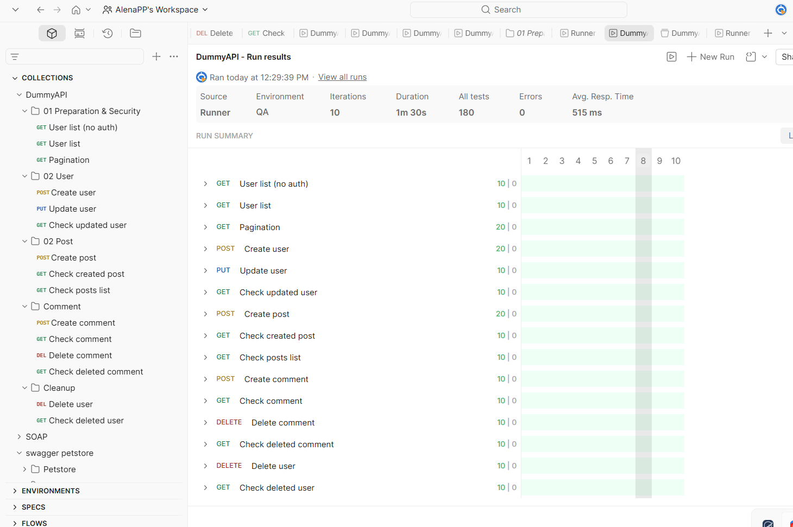

# API Automation Testing Portfolio: Dummy API (CRUD & E2E)

This repository contains a robust Postman collection and environment for automated testing of the **Dummy API** service. The project demonstrates advanced testing techniques, including End-to-End (E2E) workflows, dynamic data management, and security validation.

## 🛠 Features & Technical Highlights

*   **15 Automated Requests**: Covering complete CRUD lifecycles for Users, Posts, and Comments.
*   **Smart Workflow (E2E)**: Seamless data transfer between requests. IDs from created entities (Users/Posts) are dynamically captured and passed to subsequent Update and Delete operations.
*   **Advanced Assertions**: 
    *   Response code validation (200, 403, 404).
    *   Response time monitoring (Performance benchmarks).
    *   Header verification (Checking for specific metadata/strings).
    *   Negative testing (Validating behavior after resource deletion).
*   **Data Handling**: Extensive use of `x-www-form-urlencoded` body format and Postman dynamic variables (`{{$random...}}`).
*   **Stability**: The collection is optimized for multiple iterations in **Postman Collection Runner** without data collisions or manual intervention.

## 📂 Project Structure

1.  **00 Preparation & Security**: Pagination checks and unauthorized access tests (Negative cases).
2.  **01 User Management**: Creation and profile updates with dynamic email generation.
3.  **02 Content Flow**: Creating posts and comments linked to the previously created user.
4.  **03 Cleanup**: Systematic deletion of all created resources to maintain a clean environment.

## 🚀 How to Run

1.  **Clone** this repository or download the `.json` files from the `/postman` folder.
2.  **Import** the Collection and Environment files into Postman.
3.  **Setup API Key**:
    *   Get your `app-id` from [hub.dummyapi.io](https://dummyapi.io).
    *   In Postman, open the imported Environment.
    *   Paste your key into the **Current Value** of the `app-id` variable.
4.  **Execute**: Open the Collection Runner, select the environment, and click **Run**.

## 📊 Results 

